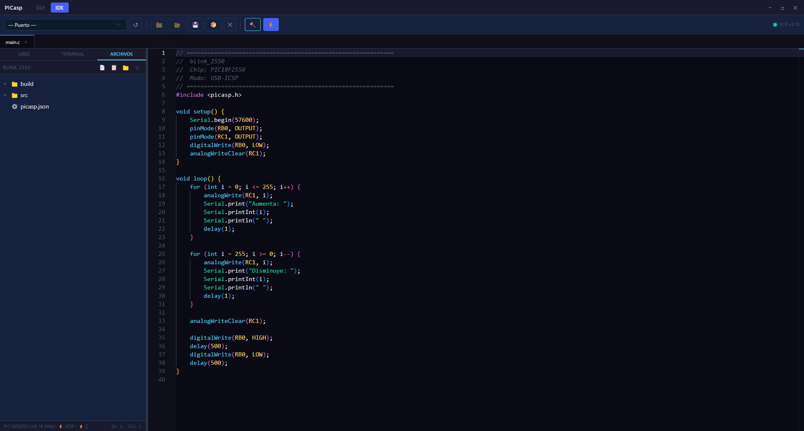

# PICasp

**PICasp** es un entorno de desarrollo integrado (IDE) y programador de escritorio para microcontroladores PIC de Microchip que se encuentra en constante desarrollo, construido con Electron. Combina en una sola aplicación un editor de código, compilador con MPLAB XC8, programador USB-ICSP / Bootloader USB-Serial y monitor serie.




---

## Características

### 🖥️ IDE integrado
- Editor Monaco (el mismo motor de VS Code) con resaltado de sintaxis C
- Gestión de proyectos con árbol de archivos, tabs múltiples y restauración automática de sesión
- Compilación directa con MPLAB XC8 desde la interfaz, con salida en tiempo real
- Monitor serie integrado con timestamp, autoscroll y saltos de línea configurables (CR, LF, CR+LF)
- Gestor de librerías via GitHub
- Watcher de archivos: detecta cambios externos y recarga automáticamente

### ⚡ Programador (GUI)
- Grabar, leer, verificar y borrar la Flash del PIC
- Leer y escribir EEPROM
- Leer, escribir y visualizar Config Words (Fuses) con interfaz visual por campo
- Dump completo (Flash + EEPROM + Fuses) a archivo HEX
- Drag & drop de archivos HEX
- Dos modos de programación:
  - **USB-ICSP:** via Arduino Uno/Nano como programador (firmware)
  - **USB-Serial Bootloader:** via protocolo TinyBLD para PICasp Boards

### 📦 HAL `picasp.h` — API estilo Arduino para PIC
- Objetos `Serial`, `Wire` (I2C), `SPI`, `EEPROM`, `DAC`
- Macros matemáticas (`PI`, `abs`, `min`, `max`, `sq`, `round`, `radians`, `degrees`)
- Macros de bits (`bitRead`, `bitSet`, `bitClear`, `bitToggle`, `bitWrite`)
- Macros de bytes (`lowByte`, `highByte`)
- Control de interrupciones (`interrupts()` / `noInterrupts()`) diferenciado por familia PIC18 / PIC16

---

## Chips soportados

### Modo USB-ICSP (via Arduino Uno/Nano)

| Familia | Chips | Datasheet |
|---------|-------|-----------|
| PIC18F | 2455, 2550, 4455, 4550 | DS39632E |
| PIC18F | 242, 252, 442, 452 | DS39576C |
| PIC18F | 25K22 | DS41398B |
| PIC16F | 627A, 628A, 648A | DS41196G |
| PIC16F | 873A, 874A, 876A, 877A | DS39589C |

### Modo Bootloader USB-Serial (PICasp Boards)

| Board | Chip | Baud |
|-------|------|------|
| PICasp Board K22 | PIC18F25K22 | 115200 |
| PICasp Board 2550 | PIC18F2550 | 115200 |
| PICasp Board 252 | PIC18F252 | 57600 |

---

## Requisitos

### Hardware
- **Arduino Uno/Nano** para modo USB-ICSP (requiere firmware `PICasp.ino v1.0.0`)
- O una **PICasp Board** con adaptador USB-UART compatible para modo Bootloader:

| Chip adaptador    | Modelo 
|-------------------|--------------
| CP210x            | Silicon Labs 
| PL2303            | Prolific 
| MCP2200           | Microchip 
| FT232RL           | FTDI 
| CH340             | WCH 

### Software
- [Node.js](https://nodejs.org/) v18 o superior
- [Python 3](https://www.python.org/) con `pyserial`:
```bash
  pip install pyserial
```
- [MPLAB XC8](https://www.microchip.com/en-us/tools-resources/develop/mplab-xc-compilers) (gratuito, licencia "Free") — requerido solo para compilar código C

> **Nota:** MPLAB XC8 es un compilador propietario de Microchip. PICasp es open source pero no incluye ni redistribuye XC8. Debe instalarse por separado.

---

## Instalación y ejecución desde código fuente

```bash
# Clonar el repositorio
git clone https://github.com/gustavofernandez/picasp.git
cd picasp

# Instalar dependencias Node.js
npm install

# Ejecutar en modo desarrollo
npm start
```

---

## Estructura del proyecto
```
picasp/
├── main.js                  # Proceso principal Electron (IPC, ventana, puertos serie)
├── preload.js               # Puente seguro renderer ↔ main (contextIsolation)
├── renderer/
│   ├── index.html           # UI principal
│   ├── style.css            # Estilos globales
│   ├── app.js               # Panel Programador
│   ├── editor.js            # IDE: editor Monaco, pestañas, árbol de archivos
│   ├── fuses-config.js      # Definición de Config Words por familia de chip
│   ├── xc8-modal.js         # Modal de instalación guiada de XC8
│   └── bl-modal.js          # Modal para grabar bootloader en PICasp Boards
├── python/
│   ├── pic_flash.py         # Programador ICSP via Arduino (PIC18F y PIC16F)
│   ├── pic_bl_flash.py      # Programador tipo TinyBLD via USB-Serial (PICasp Boards)
│   ├── pic_build.py         # Wrapper de compilación XC8
│   └── firmware/
│       ├── picasp_firmware.hex   # Firmware precompilado para Arduino Uno/Nano
│       ├── bootloader_k22.hex    # Bootloader PICasp Board K22
│       ├── bootloader_2550.hex   # Bootloader PICasp Board 2550
│       └── bootloader_252.hex    # Bootloader PICasp Board 252
├── hal/
│   ├── picasp.h             # HAL principal — API estilo Arduino v1.0.0
│   ├── picasp_objects.c     # Instancias globales (Serial, Wire, SPI, EEPROM, DAC)
│   └── common/              # HALs individuales por periférico y familia de chip
├── arduino/
│   └── PICasp.ino           # Firmware del programador USB-ICSP para Arduino Uno/Nano
└── assets/                  # Íconos y recursos estáticos
```
---

## Firmware Arduino (modo USB-ICSP)

Para usar el modo USB-ICSP necesitás grabar el firmware `PICasp` en un Arduino Uno/Nano. Podés hacerlo desde la propia aplicación en **GUI → Herramientas → Grabar Firmware PICasp**.

**Conexiones Arduino Uno/Nano → PIC (ICSP LVP):**

| Arduino Uno/Nano  | Señal PIC     | Notas 
| D2 (RX)           | TX            | Disponible para comunicacion serial
| D3 (TX)           | RX            | Disponible para comunicacion serial
| D4                | MCLR          | Via resistencia pull-up 10 kΩ a VCC 
| D5                | PGM           | Via resistencia 10 kΩ a GND 
| D6                | PGD           |
| D7                | PGC           | 
| 5V                | VDD           | 
| GND               | GND           | 

---

## Uso rápido

### Programar un PIC via USB-ICSP

1. Conectar el Arduino Uno/Nano con firmware PICasp al PC
2. Abrir PICasp → panel **GUI**
3. Seleccionar el puerto serie del Arduino y el chip target
4. Cargar un archivo `.hex` (o arrastrarlo a la ventana)
5. Hacer clic en **Flash**

### Compilar y grabar desde el IDE

1. Crear un proyecto nuevo → **IDE → Nuevo Proyecto**
2. Seleccionar chip, oscilador y frecuencia
3. Escribir el código en el editor (estructura `setup()` / `loop()`)
4. Hacer clic en **Compilar y Grabar** (⚡)

### Estructura de un proyecto PICasp

```c
#include <picasp.h>

void setup() {
    Serial.begin(9600);
    pinMode(RB0, OUTPUT);
}

void loop() {
    digitalWrite(RB0, HIGH);
    delay(500);
    digitalWrite(RB0, LOW);
    delay(500);
    Serial.println("Blink!");
}
```

---

## Compilar para distribución

```bash
npm run build
```

Genera un instalador para la plataforma actual usando `electron-builder`. El instalador incluye Python embebido y los scripts de programación, por lo que el usuario final no necesita instalar Python.

---

## Licencia

El IDE y sus componentes están licenciados bajo **GNU GPL v3**.
La HAL (`hal/picasp.h` y archivos relacionados) está licenciada bajo **GNU LGPL v3**,
permitiendo su uso en proyectos de firmware propietario o privado.

Ver [LICENSE](LICENSE) y [hal/LICENSE](hal/LICENSE) para más detalles.

MPLAB XC8 es propiedad de Microchip Technology Inc. y se distribuye bajo su propia
licencia. Este proyecto no incluye, no redistribuye ni modifica XC8.

---

## Contribuciones

¡Las contribuciones son bienvenidas! Para colaborar:

1. Hacé un fork del repositorio
2. Creá una rama: `git checkout -b feature/mi-mejora`
3. Commiteá tus cambios con mensajes claros
4. Abrí un Pull Request describiendo qué cambia y por qué

Para reportar bugs o sugerir mejoras, usá el sistema de [Issues](https://github.com/gustavofernandez/PICasp-IDE/issues).

---

## Créditos

Desarrollado por **Gustavo Fernández**.

Construido con:
- [Electron](https://www.electronjs.org/)
- [Monaco Editor](https://microsoft.github.io/monaco-editor/)
- [Bootstrap](https://getbootstrap.com/)
- [pyserial](https://pyserial.readthedocs.io/)
- [MPLAB XC8](https://www.microchip.com/en-us/tools-resources/develop/mplab-xc-compilers) (Microchip Technology)
